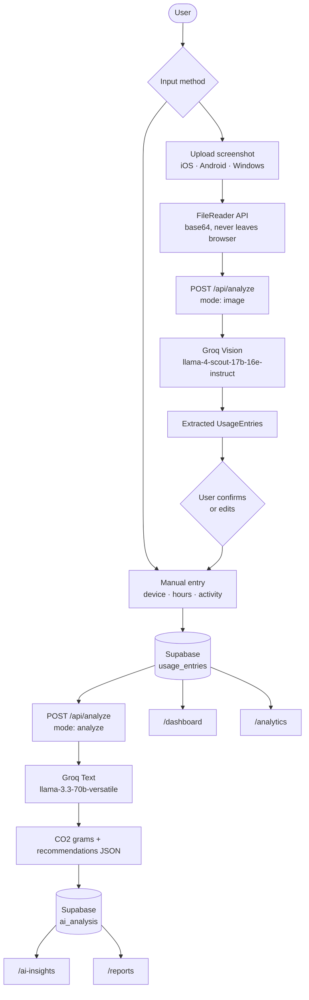
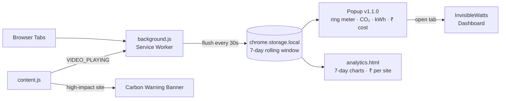
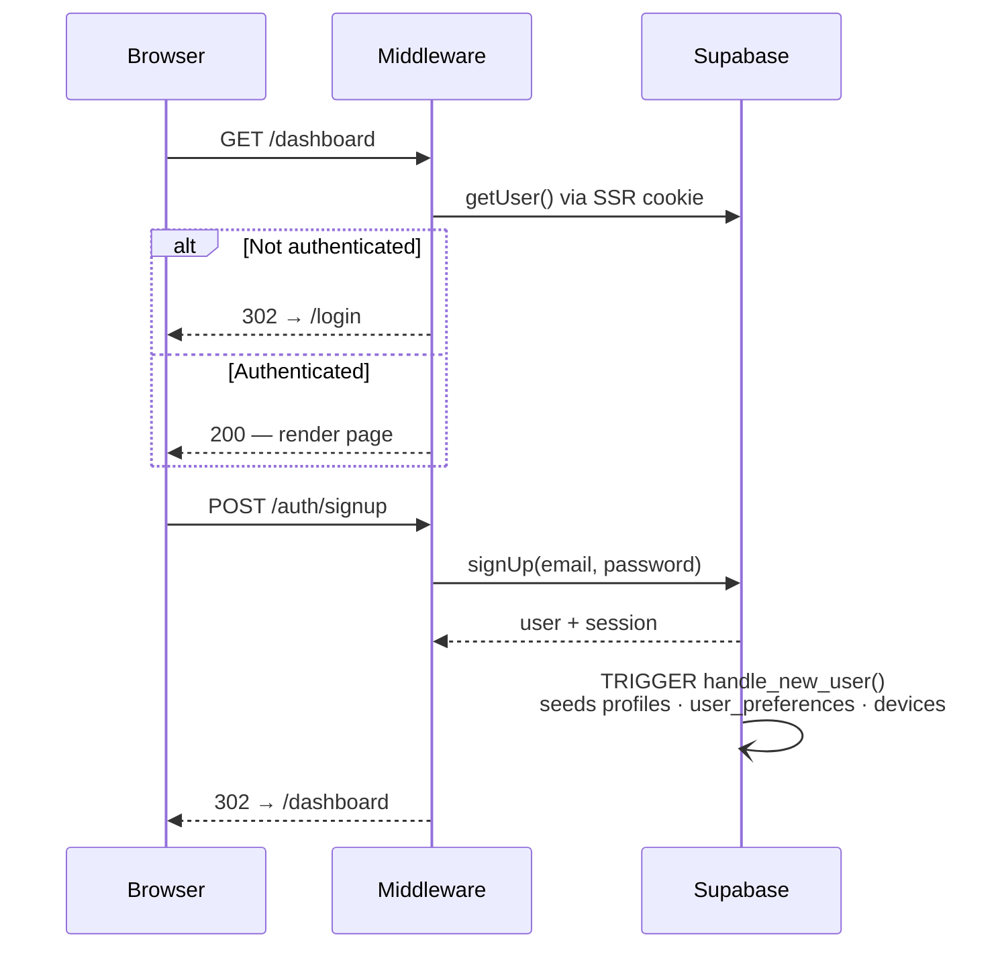

<div align="center">


# InvisibleWatts

**Google Analytics for Digital Carbon** — quantify the hidden CO₂ cost of your digital life.

[](https://nextjs.org)
[](https://www.typescriptlang.org)
[](https://tailwindcss.com)
[](https://supabase.com)
[](https://groq.com)
[](https://pnpm.io)
[](LICENSE.md)
[](https://github.com/manasdutta04/invisiblewatts/releases)
[](https://v0.app/chat/projects/prj_bvkaxpFYEFdavofL2NsqwguCfEMy)


</div>

---

## What is InvisibleWatts?

Every stream, scroll, and search burns electricity — and that electricity has a carbon cost that nobody talks about. **InvisibleWatts makes it quantifiable.**

Users upload their phone or laptop screen time reports (iOS Screen Time, Android Digital Wellbeing, or Windows activity), or manually enter device usage data. Groq AI extracts the data, calculates CO₂ grams using real emission factors, and generates personalised recommendations to reduce your digital footprint.

> Think of it as a carbon counter that lives in your browser tab and your pocket — passive, accurate, and actionable.

---

## Core Features

| Feature | Description |
|---|---|
| **Screenshot Upload** | Drag in an iOS/Android screen time screenshot — Groq's vision model extracts all usage data automatically |
| **Manual Entry** | Enter device, hours, and activity type row-by-row with an editable table |
| **AI CO₂ Analysis** | Groq `llama-3.3-70b` calculates per-entry carbon grams using device + activity emission multiples |
| **Energy Cost (₹)** | Converts CO₂ → kWh → ₹ using India's avg grid factor (475 gCO₂/kWh) and tariff (₹7/kWh) — shown on dashboard, reports, and AI insights |
| **Dashboard** | Real-time metrics including CO₂, avg per session, top device, and estimated energy cost |
| **Analytics** | Monthly CO₂ trends, category breakdowns, and time-of-use heatmaps |
| **AI Insights** | Stored AI analysis results with ranked reduction tips and per-analysis cost breakdown |
| **Reports** | Filterable report cards with CO₂ + ₹ cost display and client-side `.txt` download |
| **Chrome Extension** | Passive tab-level CO₂ and ₹ energy cost estimation with 40+ site profiles — v1.1.0 |
| **Demo Mode** | Cookie-based toggle that overlays hardcoded data on every page — no sign-up required |

---

## How It Works

### Web App Data Pipeline



### CO₂ Emission Factors

```
Base rates (gCO₂/hour):     Activity multipliers:
  Phone      →   0.4 g        Streaming  × 3.0
  Laptop     →  10.0 g        Gaming     × 2.0
  Tablet     →   3.0 g        Social     × 2.0
  Desktop    →  20.0 g        Calls      × 1.5
  Smart TV   →  35.0 g        Mixed      × 1.2
  Console    →  50.0 g        Browsing   × 1.0
  Smartwatch →   0.05 g       Productivity × 0.7

  Final: CO₂ (g) = base_rate × hours × activity_multiplier

Energy cost conversion (India):
  kWh  = CO₂ (g) ÷ 475          (global avg grid factor: 475 gCO₂/kWh)
  ₹    = kWh × 7                 (India avg domestic tariff: ₹7/kWh)
```

### Chrome Extension Architecture



### Authentication & Route Protection



---

## Tech Stack

| Layer | Technology |
|---|---|
| Framework | Next.js 15 (App Router, Turbopack) |
| Language | TypeScript 5 |
| Styling | Tailwind CSS 3.4 + shadcn/ui (New York, neutral) |
| Animations | Motion (`motion/react`) |
| Charts | Recharts 2 |
| Icons | Lucide React + Tabler Icons |
| Database + Auth | Supabase (PostgreSQL + Row-Level Security) |
| AI | Groq API — Llama 4 Scout (vision) · Llama 3.3 70B (text) |
| Package manager | pnpm |
| Deployment | Vercel |

---

## Setup & Development

For environment variables, database setup, project structure, and Chrome extension loading — see **[SETUP.md](SETUP.md)**.

---

## Demo Mode

A cookie (`iw_demo_mode=1`) overlays static hardcoded data across every data page, so anyone can explore the full UI without uploading anything. Toggle it from the sidebar's **Demo** button — it turns violet with an "ON" badge when active. Server components check `cookies().get("iw_demo_mode")?.value === "1"` and return data from `lib/demo-data.ts` instead of querying Supabase.

---

## Contributing

Contributions are welcome! See [CONTRIBUTING.md](CONTRIBUTING.md) for setup instructions, coding standards, and the PR process.

## Security

Found a vulnerability? Please **do not** open a public issue. See [SECURITY.md](SECURITY.md) for the responsible disclosure policy.

## License

MIT — see [LICENSE.md](LICENSE.md).

## Creators

<table>
  <tbody>
    <tr>
    <td align="center" valign="top" width="14.28%"><a href="https://github.com/manasdutta04"><br /><sub><b>Manas Dutta</b></sub></a><br /></td>
      <td align="center" valign="top" width="14.28%"><a href="https://github.com/priya369-ps"><br /><sub><b>Priya Kanta</b></sub></a><br /></td>
    </tr>
  </tbody>
</table>
